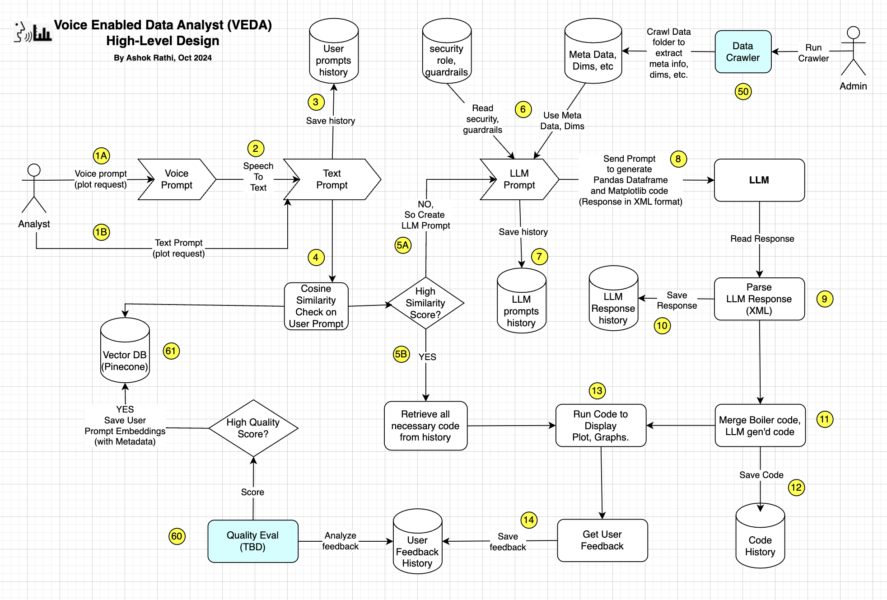

# GenAI-based Voice-Enabled Data Analyst (VEDA) Tool
Based on Text or Voice prompt, this GenAI Data Analyst tool invokes LLM to generate matplotlib code to facilitate creation of bar charts and graphs for your private data.

## Features.
1. Takes voice prompt or text prompt from the user.
2. Augments this user prompt (RAG) with additional context including meta-data info about the user-selected dataset.
3. Sends this context + user prompt to the LLM for code generation.
4. Parses the LLM response using simple XML parser. Response should contain Pandas and Matplotlib code.
5. Edits relevant sections of the Pandas code to create Dataframe(s) using private data.
6. Newly created dataframes with private data are used by Matplotlib to generate Bar Chart/Pie Charts etc.
7. Complete Streamlit App code is generated into file which is then launched to display charts/graphs etc.
8. Tool also seeks human feedback for the quality of charts/graphs based on the prompt.

## Libraries/Technolgies Used
1. App: Streamlit
2. Language: Python
3. Charts/Graphs: Pandas, Matplotlib
4. Model/LLM: OpenAI gpt-4o-mini
5. Framework: LangChain
6. VectorDB: Pinecone DB  (TBD)
7. Speech to Text: Speech Recognition module from Google
8. Logger: Loguru
9. Image display: Pillow

Note: This is still work-in-progress.

## Tool Diagram

